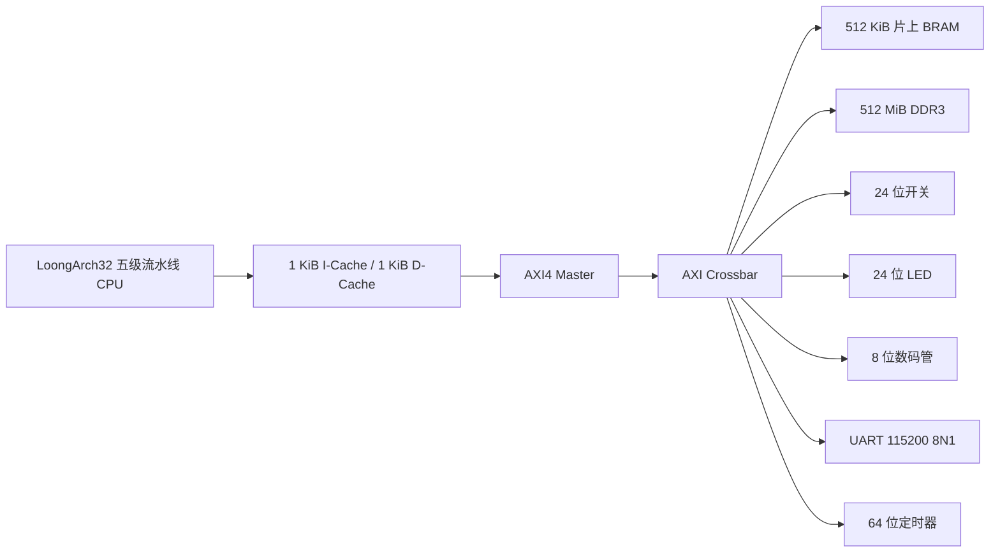

# miniLA：LoongArch32 五级流水线 AXI SoC

miniLA 是一个使用 Verilog 实现的 32 位 LoongArch 教学处理器与片上系统。项目以五级流水线 CPU 为核心，通过 AXI4 总线连接片上 BRAM、DDR3、UART、开关、LED、数码管和定时器，并提供了可在该处理器上运行的 LLaMA 推理程序。

当前工程面向 Xilinx Artix-7 `xc7a100tfgg484-1`，使用 Vivado 2023.2 开发和验证。CPU 工作频率为 50 MHz，DDR3 MIG 参考时钟为 200 MHz。

## 系统结构



### CPU 核心

- 32 位 LoongArch 指令子集，程序入口地址为 `0x0000_0000`。
- IF、ID、EX、MEM、WB 五级流水线。
- 数据前递、Load-Use 冒险检测、流水线暂停和冲刷。
- 16 项分支历史表，每项使用两位饱和计数器并保存分支目标。
- 独立乘法器和除法器，支持有符号/无符号乘、除和取模。
- 1 KiB I-Cache 和 1 KiB D-Cache；每条 Cache Line 为 128 位（4 个 32 位字），共 64 行。
- 内存映射外设绕过 D-Cache，保证 UART、GPIO 和定时器访问直接到达设备。

当前软件工具链检查的指令包括：

```text
add.w addi.w sub.w
and andi or ori xor xori nor
sll.w slli.w srl.w srli.w sra.w srai.w
slt slti sltu sltui
mul.w mulh.w mulh.wu div.w div.wu mod.w mod.wu
ld.b ld.bu ld.h ld.hu ld.w st.b st.h st.w
b bl beq bne blt bge bltu bgeu jirl
lu12i.w pcaddu12i move
```

这不是完整的 LoongArch ISA 实现。交叉编译脚本会检查最终链接后的程序（包括 libc、libgcc 和 libm），发现 CPU 不支持的指令时停止生成 COE。LLaMA 中的浮点运算由软件库实现，不依赖硬件 FPU。

## 地址空间

| 地址范围 | 大小 | 设备 | 用途 |
| --- | ---: | --- | --- |
| `0x0000_0000`–`0x0007_FFFF` | 512 KiB | AXI BRAM | 启动代码、只读数据和片上数据 |
| `0x2000_0000`–`0x3FFF_FFFF` | 512 MiB | DDR3 | 堆、栈和大容量运行数据 |
| `0xFFFF_0000` | 4 KiB | Switch | 读取 24 位拨码开关 |
| `0xFFFF_1000` | 4 KiB | LED | 控制 24 位 LED |
| `0xFFFF_2000` | 4 KiB | Digital LED | 控制 8 位数码管 |
| `0xFFFF_3000` | 4 KiB | UART | 串口输入输出，115200 baud、8N1 |
| `0xFFFF_4000` | 4 KiB | Timer | 读取 64 位自由运行计数器 |

启用 DDR3 时，MIG 完成初始化和校准之前 CPU 保持复位，AXI 总线和 MIG 本身仍可正常运行。

## LLaMA 软件

`software/llama/` 包含适配本 SoC 的 LLaMA C 程序、UART/Timer 库、模型数据头文件以及两种构建方式。

### Windows 本机功能测试

安装 GCC 并加入 `PATH`，然后执行：

```bat
cd software\llama
build_windows.bat
llama_windows.exe
```

该版本使用 `C_TEST` 模式在 Windows 主机上检查 LLaMA 程序本身，不经过 FPGA 外设。

### LoongArch 交叉编译

脚本需要 `loongarch32r-linux-gnusf-*` 工具链和安装在 `/opt/picolibc` 的 Picolibc：

```bash
cd software/llama
./compile_use_ddr.sh
```

脚本将：

1. 使用自定义链接脚本分配片上 BRAM 和 DDR3；
2. 链接 Picolibc、libgcc 和 libm；
3. 反汇编并检查最终指令是否被 CPU 支持；
4. 生成 `main.s` 和 `main.coe`。

生成的 `main.coe` 可通过 `scripts/select_llama_coe.tcl` 写入工程。选择顺序为：

1. `software/llama/main.coe`；
2. 兼容旧目录的 `../5_llama2.c/main.coe`；
3. 仓库中已验证的 `src/coe/llama.coe`。

## 工程目录

| 路径 | 内容 |
| --- | --- |
| `miniLA.xpr` | Vivado 2023.2 工程入口 |
| `src/rtl/` | CPU、Cache、AXI 和外设 RTL |
| `src/rtl/ip/` | Vivado IP 的可复现 XCI 配置 |
| `src/coe/` | BRAM 初始化文件 |
| `src/xdc/` | 时钟、引脚和跨时钟域约束 |
| `src/sim/` | SoC、DDR3 和指令单元测试 |
| `miniLA.srcs/` | MIG XCI 与 DDR3 PRJ 配置 |
| `software/llama/` | LLaMA C 程序、外设库和编译脚本 |
| `scripts/` | IP 重建、工程检查、仿真和 bitstream 脚本 |

Vivado 生成的 `.gen`、`.runs`、`.sim`、IP 派生网表、缓存和 bitstream 均不进入 Git。仓库只保存能够重新生成工程的源文件和 IP 配置。

## Vivado 使用方法

首次克隆后，使用 Vivado 2023.2 打开 `miniLA.xpr`。由于仓库不保存 IP 派生文件，需要先在 Tcl Console 中执行：

```tcl
source scripts/regenerate_ip.tcl
```

常用脚本：

```tcl
# 检查工程源文件和 14 个 IP 的状态
source scripts/project_check.tcl

# 选择 LLaMA COE，并重新生成 bram_axi
source scripts/select_llama_coe.tcl

# 运行 200 us SoC 行为仿真
source scripts/sim_smoke.tcl

# 完成综合、实现并生成 bitstream
source scripts/build_fixed_bitstream.tcl
```

也可以在命令行运行，例如：

```powershell
vivado -mode batch -nojournal -nolog -source scripts/project_check.tcl
vivado -mode batch -nojournal -nolog -source scripts/sim_smoke.tcl
vivado -mode batch -nojournal -nolog -source scripts/build_fixed_bitstream.tcl
```

如只需重新生成一个 IP：

```powershell
vivado -mode batch -nojournal -nolog -source scripts/regenerate_ip.tcl -tclargs clk_wiz_0
```

## 已验证状态

迁移后的仓库已从零缓存副本完成以下验证：

- 14 个 Vivado IP 全部可由 XCI/PRJ 重新生成并处于 `Up-to-date` 状态。
- NOR 指令单元测试通过，结果为 `0xC0C0AA00`。
- SoC 行为仿真运行 200 us，取指、AXI 读写、DDR3 和寄存器回写均有持续进展。
- 顶层综合、布局、路由和 bitstream 生成完成。
- 路由后 WNS 为 `+1.274 ns`，TNS 为 `0`。
